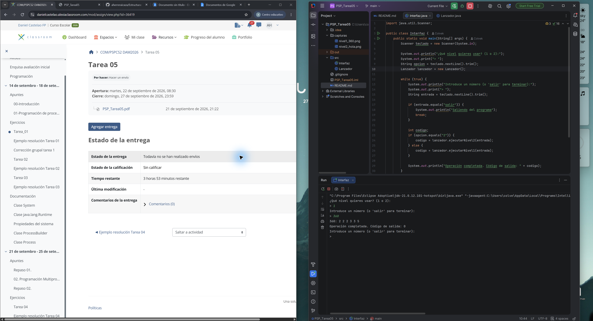
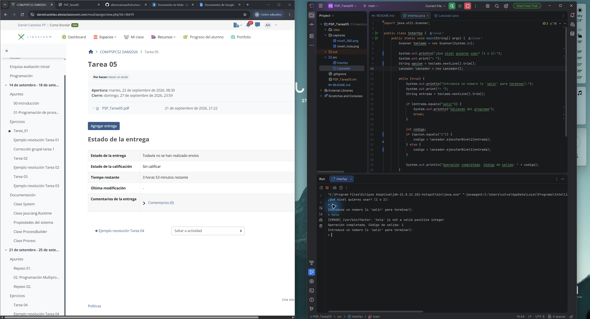

Tarea 05 - PSP

Antuan Herrera Icaza - DAM2

Lo que hice

He hecho los niveles 1 y 2. El programa tiene dos clases: Interfaz pide los datos
hasta que se escribe salir, y Lanzador ejecuta el comando factor y devuelve su
código de salida.

En el nivel 1 se ve la salida de factor directamente en la consola. En el nivel 2
leo la salida normal y los errores por separado, y añado [OK] o [ERROR] a cada línea.

En Linux el programa usa el comando factor. En mi ordenador, que es Windows, uso
el factor.exe que viene con Git for Windows porque Windows no trae ese comando.

Pruebas que hice en Windows

| Valor | Salida de factor | Código de salida |
|---|---|---|
| 360 | 360: 2 2 2 3 3 5 | 0 |
| 1 | 1: | 0 |
| 17 | 17: 17 | 0 |
| hola | /usr/bin/factor: 'hola' is not a valid positive integer | 1 |
| -5 | factor: unknown option -- 5 | 1 |

Con -5, el programa factor interpreta el guion como una opción. Por eso muestra
un error y después otra línea que indica cómo consultar la ayuda.
En Linux el texto de los errores puede salir un poco diferente.

Captura con un número correcto:

Captura con un dato incorrecto:

Un error que tuve

Al principio intenté usar factor como si estuviera instalado en Windows y el proceso
no arrancaba. Comprobé que Git for Windows incluye factor.exe y puse su ruta en
Lanzador. Después pude ejecutar las pruebas desde IntelliJ.
